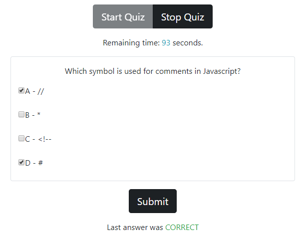
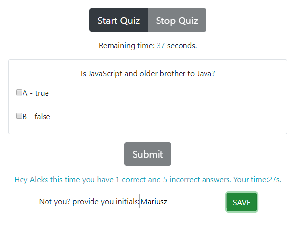

# JavaScipt QUIZ

This is a simple web page which acts as a short quiz. There are only a few questions, which are multiple choice. 

## Getting Started

Open the web page in your browser. When ready, click START and the quiz will begin. There are 120 seconds to answer to 6 questions. Each incorrect answer will reduce the timer by 10 seconds. At the end, provide your initials so the web page will use them next time, when you repeat the quiz. Data is stored locally in your browser.

## Prerequisities

You just need a web browser. The project was tested on:
* desktop Chrome
* mobile Chrome

### Example

### Built with

To build this project I used:
* static html
* bootstrap
* custom css
* javascript managing DOM
* local storage